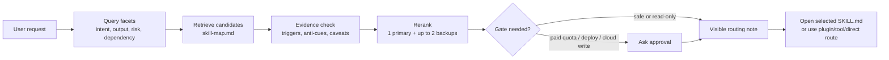
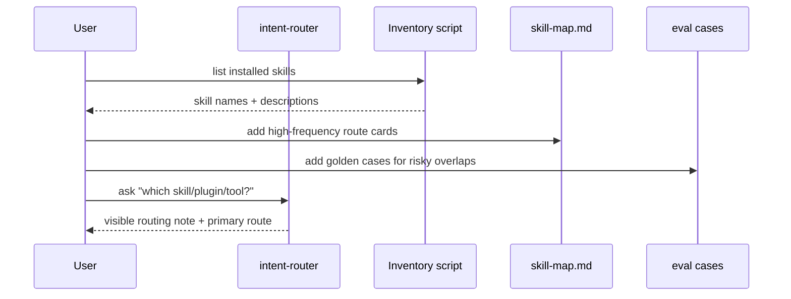

# Intent Router Skill

English | [中文 README](README.zh-CN.md)

An installable agent skill for routing user intent to the right skill, plugin, connector, app tool, or direct workflow.

It is for people whose skill/plugin library has become useful enough to become hard to remember. The router treats each request like a small RAG query: understand intent, retrieve candidate routes, check evidence, rerank, expose the routing reason, then recommend or execute.



## Why This Exists

Large skill libraries fail in a predictable way: users install many useful tools, then forget which one to call. A router skill becomes useful only if it is specific enough to choose well, but generic enough that other people can safely customize it.

This public version is designed to avoid common adoption failures:

| Failure users feel | Built-in mitigation |
|---|---|
| "It recommended something I do not have." | Local inventory helper and customizable `skill-map.md`. |
| "It silently deployed or spent quota." | Cost and external side-effect gates. |
| "It pretended a plugin was available." | Plugin/connector callability preflight. |
| "It gave me a giant skill directory." | One primary route and at most two backups. |
| "I cannot tell why it chose that." | Visible routing note for non-trivial requests. |
| "It only works for the author's setup." | Generic starter route cards and personalization slots. |

See [references/failure-checklist.md](references/failure-checklist.md) for the full audience failure checklist.

## Routing Regression Dataset

This version includes a small top-k routing dataset and a deliberately simple evaluator:

```bash
python3 scripts/eval_router_dataset.py --show-failures
```

The dataset checks whether the expected primary route appears within the first three retrieved candidates. It is meant to catch stale route triggers and obvious rerank drift, not to replace human review.

The 2026-06-17 evaluation added a regression for a broad high-risk redesign prompt: when a user says a system is terrible, asks to search again, build on another project, personalize it, make it verifiable/iterative, and add scheduled actions, the router should choose an upstream discovery/brainstorming route before implementation, research, or automation.

See [references/router-eval-report-2026-06-17.md](references/router-eval-report-2026-06-17.md) for the test-set construction notes, first-run failures, changes made, and second-run result.

## What Users See

The router should not just say a skill name. It should show a compact route trace:

```markdown
Routing note: detected editable presentation output;
candidates were presentation route, polished PDF route, academic planning route;
selected presentation route because the user asked for editable PPTX;
did not use polished PDF route because PDF is not the requested output;
next step: inspect source material or ask for slide constraints.
```

Then it should name one primary route and at most two auxiliary routes:

```markdown
Primary: `presentation route` - best for editable `.pptx` decks.
Also consider:
- `academic planning route` - if grading/rubric alignment matters.
- `repo audit route` - if the slides need evidence from a codebase.
```

## Successful Routing Examples

These examples come from manual golden-case testing of the router pattern. They are included to make the expected behavior concrete.

| User request | Expected routing result | Why it passed |
|---|---|---|
| "I want to make an FYP presentation deck. Recommend only." | Primary: presentation/PPTX route. Backup: rubric or repo-audit route. | It respected recommendation-only mode and prioritized editable slides over polished PDF. |
| "Which plugin should I use to search my cloud documents? Recommend only." | Primary: plugin recommendation route. | It recommended instead of installing or executing a connector search. |
| "Use a Slack connector to find the latest team decision." | Primary: plugin/connector preflight route. | It checked callability before claiming the connector was used. |
| "Run the OpenAI API to embed this folder." | Primary: metered API route with approval gate. | It treated API key presence as not enough for paid/quota-consuming calls. |
| "Deploy this app to production." | Primary: deployment route with external side-effect confirmation. | It confirmed target/environment/public-vs-private risk before mutating external state. |
| "Install this new skill from GitHub." | Primary: skill install/update route plus router sync. | It updates the route map after skill changes instead of requiring a second sync request. |
| "Do not recommend this skill anymore." | Primary: disable/hold route. | It did not delete files when the user only asked to stop recommending. |
| "Review this router skill. Do not change files." | Primary: read-only review route. | It treated the named skill as the artifact under review and avoided edits/sync. |

## Attribution

This project uses the public `skill-router` concept listed on EliteAI.tools as a reference:

- EliteAI.tools page: https://eliteai.tools/agent-skills/skill-router
- Referenced source shown there: `sickn33/antigravity-awesome-skills/skills/skill-router`

The referenced skill focuses on interviewing a user and recommending one primary skill plus up to two secondary skills. This project adapts that idea into a more configurable router with evidence checks, reranking, visible route notes, plugin/tool preflight, safety gates, and maintenance rules.

## Install

Install into your Codex skills directory:

```bash
mkdir -p ~/.codex/skills/intent-router
cp -R SKILL.md references scripts ~/.codex/skills/intent-router/
```

Then restart or refresh your agent session so the new skill appears in the active skill list.

If you use a skill installer that supports GitHub repositories, install this repository root as the skill source because `SKILL.md` is at the repo root.

## Configure



1. Run the inventory helper:

```bash
bash ~/.codex/skills/intent-router/scripts/list-installed-skills.sh
```

2. Edit:

```text
~/.codex/skills/intent-router/references/skill-map.md
```

3. Replace the starter route cards with the skill names, plugins, connectors, and direct workflows actually available in your environment.

4. Add or update golden cases in:

```text
~/.codex/skills/intent-router/references/router-eval-cases.md
```

5. Restart or refresh the agent session if newly installed skills do not appear.

## Example Invocation

```text
Use intent-router to decide which skill/plugin/tool should handle this.
```

```text
I do not know which skill to use. I want to turn a rough app idea into an implementation plan.
```

```text
Route this request, but only recommend. Do not execute anything yet.
```

## What This Skill Does Not Do

- It is not a background filesystem watcher.
- It cannot notice external edits to your skill directory unless your agent sees the change or you refresh inventory.
- It does not guarantee a plugin or connector is callable in the current session.
- It should not spend paid quota, deploy, publish, send messages, write external data, create API keys, or delete data without a gate.
- It is not a replacement for the selected skill's own `SKILL.md`.

## Repository Contents

```text
SKILL.md
README.md
README.zh-CN.md
references/
  failure-checklist.md
  router-eval-dataset.json
  router-eval-cases.md
  router-eval-report-2026-06-17.md
  skill-map.md
scripts/
  eval_router_dataset.py
  list-installed-skills.sh
```

## Maintenance Pattern

When you install, update, disable, or remove skills, update `references/skill-map.md` and add eval cases for the changed routing behavior. The router can remind the agent to do this, but it is not a daemon and cannot enforce changes made outside the current session.

## License

MIT. See [LICENSE](LICENSE).
