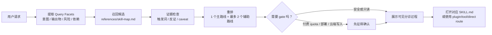
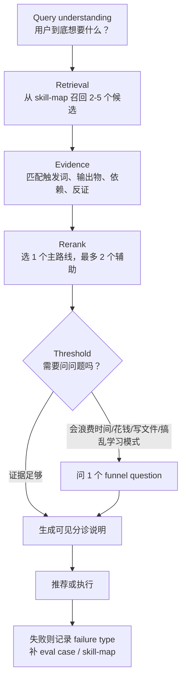
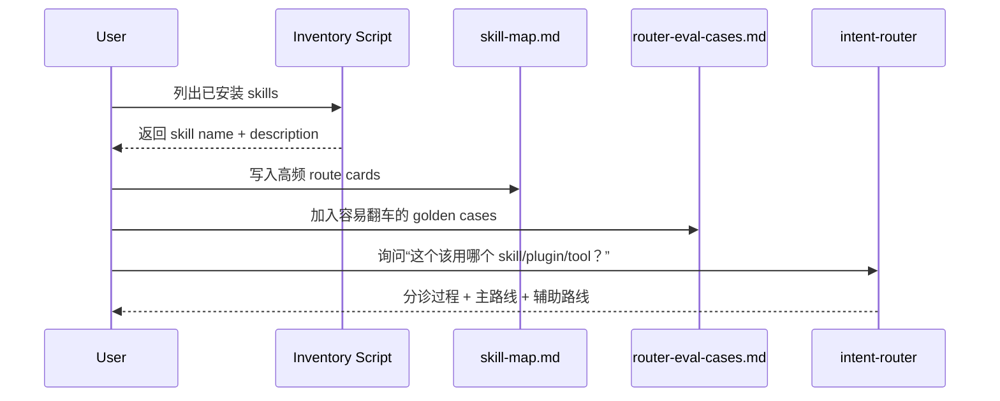

# Intent Router Skill 中文版

[English README](README.md) | 中文

`intent-router` 是一个可安装的 agent skill，用来把用户意图路由到最合适的 skill、plugin、connector、app tool 或直接工作流。

它适合这样的场景：你已经装了很多 skill / plugin，它们都挺有用，但你不想每次都记住名字、触发条件和边界。这个 router 会把一次请求当成一个小型 RAG 问题来处理：理解意图、召回候选、检查证据、重排、展示分诊理由，然后再推荐或执行。



## 这个项目解决什么问题？

当 skill 数量变多以后，真正的问题不再是“有没有工具”，而是：

- 我现在该用哪个？
- 这个请求是要推荐、执行、评估，还是只读？
- 是该用本地 skill，还是 plugin / connector？
- 会不会误调用付费 API？
- 会不会把只想“别再推荐”的需求误解成“删除文件”？
- 为什么它选择了这个 skill，而不是另一个？

`intent-router` 的目标不是替代所有 skill，而是做一层轻量的“意图分诊层”。

## 设计原则

| 用户可能吐槽的点 | 这个项目怎么规避 |
|---|---|
| 推荐了我没装的 skill | 用 inventory 脚本列出本机技能，并要求维护 `skill-map.md`。 |
| 直接花钱、部署、写云端数据 | 内置 cost gate 和 external side-effect gate。 |
| 假装插件可用 | plugin / connector 必须先做 callability preflight。 |
| 一次丢给我一整页 skill 列表 | 只给 1 个主路线，最多 2 个辅助路线。 |
| 我不知道它为什么这么选 | 非平凡请求必须展示可见分诊过程。 |
| 这是作者私有配置，别人没法用 | 默认 route card 是通用模板，个人高频工作流留给使用者自己填。 |

完整失败清单见：[references/failure-checklist.md](references/failure-checklist.md)。

## 用户会看到什么？

它不应该只输出一个 skill 名字，而应该输出一段短短的路由轨迹：

```markdown
Routing note: detected editable presentation output;
candidates were presentation route, polished PDF route, academic planning route;
selected presentation route because the user asked for editable PPTX;
did not use polished PDF route because PDF is not the requested output;
next step: inspect source material or ask for slide constraints.
```

中文使用时可以类似这样：

```markdown
分诊过程：识别到用户要的是可编辑 PPT；
候选为 presentation route、polished PDF route、academic planning route；
选择 presentation route，因为输出物是 `.pptx`；
未用 polished PDF route，因为用户没有要 PDF；
下一步：检查素材或确认页数、受众和汇报时长。
```

## 成功测试用例展示

这些是这个 router 从真实手工评估里沉淀出来的代表性 case。它们不是为了炫技，而是为了让使用者知道：什么叫“分诊成功”。

| 测试请求 | 期望路由 | 为什么算成功 |
|---|---|---|
| “我想做 FYP 汇报 PPT，只进行推荐。” | 主路线：presentation / PPTX route；辅助：rubric 或 repo-audit route。 | 尊重“只推荐”，并且把可编辑 PPT 放在 polished PDF 前面。 |
| “我该用哪个插件去搜云端文档？只推荐。” | 主路线：plugin recommendation route。 | 没有擅自安装，也没有直接执行 connector 搜索。 |
| “用 Slack connector 找最新团队决议。” | 主路线：plugin / connector preflight route。 | 先检查 connector 是否真的可调用，再决定能不能用。 |
| “用 OpenAI API 给这个文件夹跑 embedding。” | 主路线：metered API route + approval gate。 | 把“有 API key”和“同意消耗 quota”区分开。 |
| “部署这个 app 到 production。” | 主路线：deployment route + external side-effect confirmation。 | 先确认 target、env、public/private 风险，再触碰外部状态。 |
| “从 GitHub 安装这个新 skill。” | 主路线：skill install/update route + router sync。 | 安装或更新 skill 后自动同步路由表，不需要用户再说“同步 router”。 |
| “以后别推荐这个 skill 了。” | 主路线：disable / hold route。 | 只做降权或 hold，不把它误解成删除文件。 |
| “只读 review 这个 router skill，不要改文件。” | 主路线：read-only review route。 | 把被点名的 skill 当作审查对象，而不是激活它执行。 |

## 一张图理解 routing loop



## 安装

把仓库内容安装到 Codex skills 目录：

```bash
mkdir -p ~/.codex/skills/intent-router
cp -R SKILL.md references scripts ~/.codex/skills/intent-router/
```

然后重启或刷新 agent session，让新 skill 出现在可用列表中。

如果你使用支持 GitHub 的 skill installer，可以直接安装这个仓库根目录，因为 `SKILL.md` 就在 repo root。

## 配置

1. 运行 inventory helper，列出本机已有 skill：

```bash
bash ~/.codex/skills/intent-router/scripts/list-installed-skills.sh
```

2. 编辑 route map：

```text
~/.codex/skills/intent-router/references/skill-map.md
```

3. 把 starter route cards 替换成你自己真的安装了、真的高频使用的技能、插件、connector 和直接工作流。

4. 把高风险或容易混淆的场景加入 golden cases：

```text
~/.codex/skills/intent-router/references/router-eval-cases.md
```

5. 如果新 skill 没出现在 active skill list 里，重启或刷新 agent session。



## 使用示例

推荐模式：

```text
Use intent-router to decide which skill/plugin/tool should handle this. Recommend only.
```

自动分诊模式：

```text
Use intent-router to route this request and proceed if the route is safe.
```

中文也可以这样说：

```text
用 intent-router 帮我分诊这个需求，只推荐，不执行。
```

```text
我不知道该用哪个 skill，你帮我判断一下。
```

## 它不做什么

- 它不是后台文件系统 watcher。
- 它不能自动发现外部手动修改，除非 agent 参与了安装/更新/删除，或你手动刷新 inventory。
- 它不能保证某个 plugin / connector 在当前 session 一定可调用。
- 它不应该在没有确认的情况下消耗付费 quota、部署、发布、发邮件、写云端数据、创建 API key 或删除数据。
- 它不能替代被选中 skill 自己的 `SKILL.md`。

## 仓库结构

```text
SKILL.md
README.md
README.zh-CN.md
references/
  failure-checklist.md
  router-eval-cases.md
  skill-map.md
scripts/
  list-installed-skills.sh
```

## 维护方式

当你安装、更新、禁用或删除 skill 时，应该同步更新 `references/skill-map.md`，并为变化后的路由行为补充 eval cases。这个 router 可以提醒 agent 做这件事，但它不是 daemon，不能强制发现所有外部变化。

## 参考来源

这个项目参考了 EliteAI.tools 上列出的公开 `skill-router` 概念：

- EliteAI.tools 页面：https://eliteai.tools/agent-skills/skill-router
- 页面标注来源：`sickn33/antigravity-awesome-skills/skills/skill-router`

原始参考的核心模式是：当用户不知道该用哪个 skill 时，用短访谈推荐 1 个主 skill 和最多 2 个辅助 skill。本项目在此基础上加入了证据检查、rerank、可见分诊说明、plugin/tool preflight、安全 gate 和维护规则。

## License

MIT. See [LICENSE](LICENSE).
